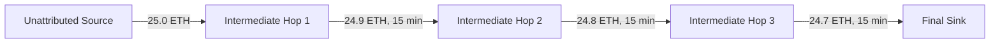
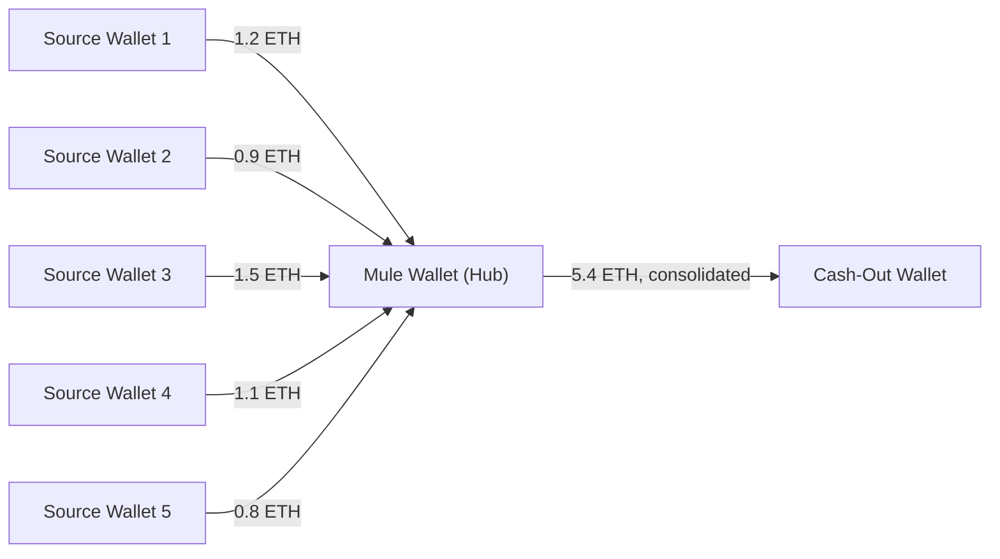
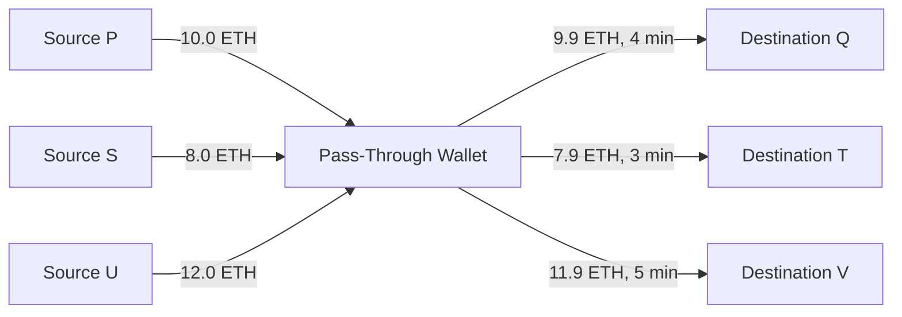
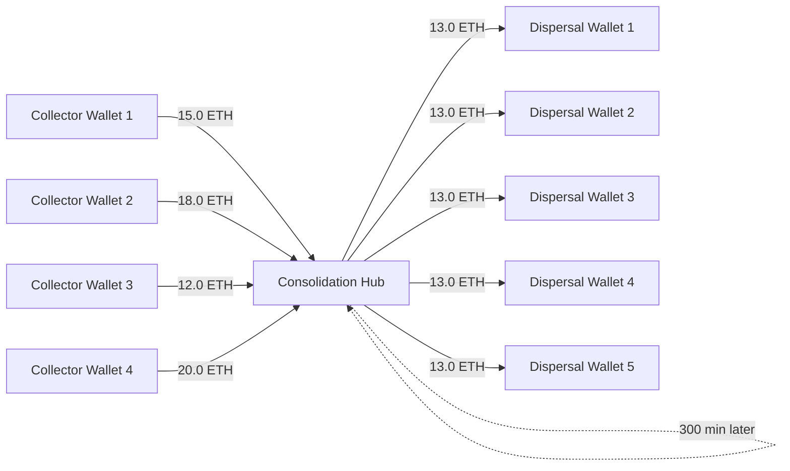
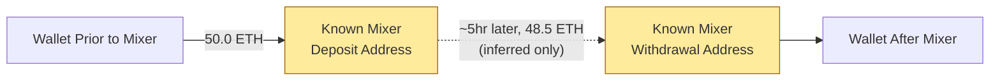
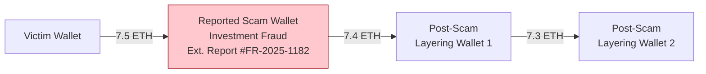
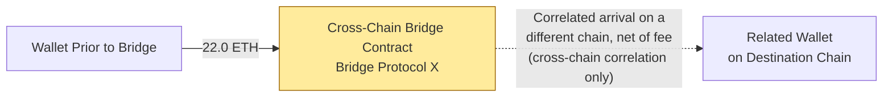

# Crypto Financial Crime Typologies — Reference Guide

Seven typologies, each with a definition, why it matters, a worked
example, a diagram, and the detection logic that catches it. This is
the kind of reference document a crypto compliance team keeps to
train new analysts and ground detection-rule design in a shared
vocabulary.

> **Data disclosure:** every wallet address, transaction hash, and
> the referenced "Bridge Protocol X" and scam report number in this
> document are fictional, generated for this demonstration.

---

## 1. Layering through crypto

**Definition:** Moving funds through a sequential chain of wallets,
each one forwarding nearly all of what it received to the next, to
put distance between the original source and the eventual
destination.

**Why it matters:** This is the crypto-native equivalent of layering
cash through shell companies. The transactions themselves usually
have no other economic purpose — their only function is to add hops
between origin and destination.

**Detection logic:** A wallet with exactly one inbound and one
outbound transaction, a dwell time under 60 minutes between them, and
over 90% of the inbound value retained in the outbound transfer.
Flagged individually, each hop looks unremarkable — the real
detection value comes from chaining flagged hops together into a
sequence (see `Wallet_Behavior_Analysis` in the workbook), which a
production system would do via graph traversal rather than treating
each hop in isolation.

---

## 2. Mule wallets

**Definition:** A wallet that collects many small amounts from
numerous unrelated sources, then forwards the consolidated total
onward — typically controlled by someone recruited (often
unknowingly) to move funds on behalf of others.

**Why it matters:** Mule wallets are frequently tied to romance
scams, job scams ("money mule" recruitment), or distributed fraud
proceeds being gathered before a single cash-out.

**Detection logic:** A wallet receiving from 4 or more distinct
counterparties, followed by a single (or very few) consolidated
outbound transfer. The key distinguishing feature from
consolidation/dispersal (typology 4) is the outbound side: a mule
wallet forwards to essentially **one** destination, while a
consolidation/dispersal hub fans back out to **several**.

---

## 3. Rapid movement of funds

**Definition:** Funds that pass through a wallet almost immediately
upon receipt, repeated across multiple cycles, rather than being
held as part of ordinary wallet activity.

**Why it matters:** A human managing a personal wallet doesn't
typically move funds out again within minutes of receiving them,
three separate times in one day, to three different destinations.
This pattern is far more consistent with scripted or automated
laundering infrastructure.

**Detection logic:** 3 or more inbound AND 3 or more outbound
transactions at the same wallet, with the dwell time between the
first inbound and first outbound under 10 minutes. The sub-10-minute
threshold is what separates this from consolidation/dispersal, which
shares the "fan-in and fan-out at one wallet" shape but unfolds over
a much longer window.

---

## 4. Wallet consolidation/dispersal

**Definition:** A two-phase pattern: multiple wallets funnel funds
INTO a hub (consolidation), which then, after an interval, sends
funds OUT to a new set of wallets (dispersal) — commonly used to
break the link between a group of source wallets and a group of
destination wallets.

**Why it matters:** This shape is genuinely ambiguous on its own —
legitimate exchange and custodian treasury operations look similar.
The distinguishing factor in practice is usually the absence of any
other legitimate business context for the wallet, combined with
other red flags elsewhere in the case.

**Detection logic:** 3 or more inbound AND 3 or more outbound
transactions at the same wallet — the same structural shape as rapid
movement — but with a dwell time of 60 minutes or more between the
first inbound and first outbound, consistent with the hub aggregating
funds over time before redistributing rather than passing them
straight through.

---

## 5. Mixer exposure

**Definition:** Direct interaction (deposit or withdrawal) with a
non-custodial mixing/tumbling service, which is specifically designed
to break deterministic on-chain traceability between the funds going
in and the funds coming out.

**Why it matters:** Legitimate privacy-seeking users of mixing
services exist, but mixer use is heavily overrepresented in
laundering flows and is treated as a significant risk indicator by
virtually every crypto compliance program.

**Detection logic:** Simple label lookup — does the counterparty
address match a known mixing service in a screening reference list?
**The critical honest caveat:** a withdrawal from a mixer can only be
*correlated* to a prior deposit by timing and amount, never provably
linked on-chain. Every project in this portfolio that touches a mixer
states this distinction explicitly rather than treating a plausible
correlation as proof.

---

## 6. Scam/fraud-related flows

**Definition:** Funds whose origin is a wallet that has been
independently identified — via a victim report, law enforcement
referral, or external database — as associated with a specific scam
or fraud scheme.

**Why it matters:** This typology is detected by **reference data**
(what's already known about a wallet), not by transaction pattern
analysis — which is exactly why keeping that reference data current
matters as much as the detection logic itself. A perfectly-designed
pattern-matching system catches nothing here if the scam-wallet list
behind it is stale.

**Detection logic:** Source (or, later in the chain, an upstream)
wallet matches an entry on an internal or external scam/fraud report
list, regardless of what the transaction pattern itself looks like.
Note how this case flows directly into typology 1 (layering) once the
scam proceeds start moving — in a real investigation, these typologies
compound rather than appearing in isolation.

---

## 7. Cross-chain movement

**Definition:** Funds that leave the chain being monitored via a
bridge protocol and reappear on a different blockchain, which breaks
single-chain analytics tooling unless the investigator specifically
correlates activity across chains.

**Why it matters:** This is an increasingly common evasion technique
precisely because most compliance tooling, and most analysts'
habitual workflow, is single-chain. Cross-chain movement exploits a
gap in *coverage*, not a gap in the blockchain's underlying
transparency — the data to follow the funds usually exists, just on
a different explorer than the one the analyst started with.

**Detection logic:** Outbound transaction to a known bridge contract
address. The real investigative work happens *off* the monitored
chain: confirming a correlated inbound arrival (by amount, net of
bridge fee, and timing) on the destination chain — which requires
either a multi-chain analytics tool or manually checking the
destination chain's own explorer.

---

## How these typologies compound in a real case

These seven rarely appear in isolation. The scam/fraud-related flow
example above (§6) shows proceeds moving directly into a layering
chain. A realistic investigation often finds several of these
typologies stacked in one case — see this portfolio's separate
**On-Chain Transaction Investigation** and **Crypto Transaction
Monitoring Case Study** projects for worked examples of exactly that:
multiple typologies compounding within a single fund-flow
investigation, rather than the clean, isolated examples shown here.
Those examples are deliberately kept simple and separated — this
document's job is to teach each pattern clearly on its own, not to
replicate the complexity of a live case.
